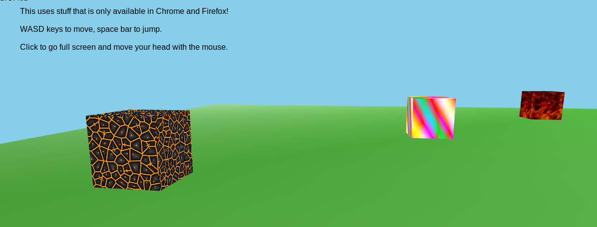

# Shadertoy for Elm

[Shadertoy](http://shadertoy.com/) is ... elite.

You write your shaders in GLSL, and game logic and physics in Elm.

The Elm code here is forked from 
Evan Czaplicki's [first-person-elm](https://github.com/evancz/first-person-elm) demo.

Make sure you have the latest version of Chrome or Firefox and then click the
following image to try out the **[live demo][demo]**:

[][demo]

[demo]: http://kfish.github.io/elm-shadertoy/

## Build Locally

```bash
git clone https://github.com/evancz/first-person-elm.git
cd first-person-elm
elm-get install
elm --make --only-js --src-dir=src Main.elm
elm-server
```

And then open [http://localhost:8000](http://localhost:8000) to see it in action!
